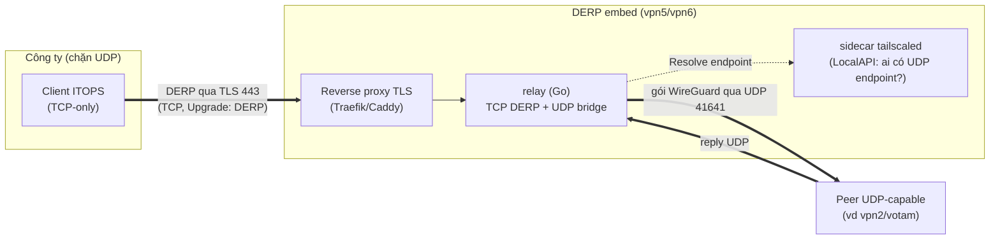
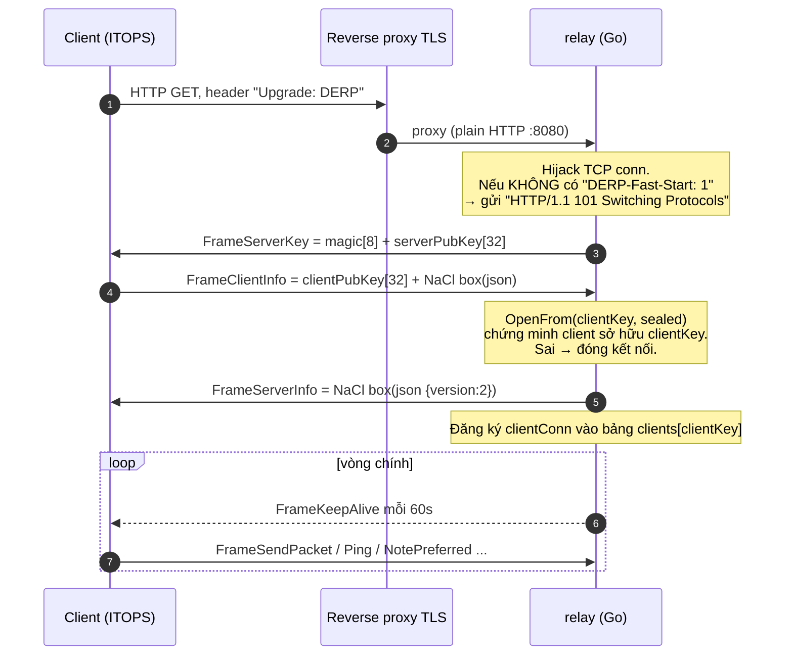
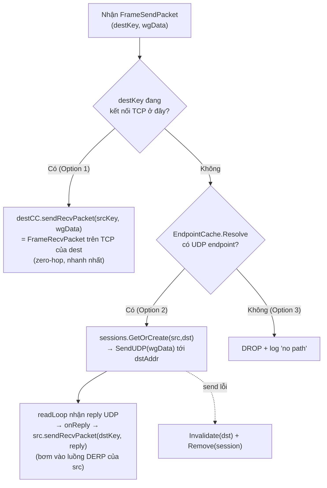
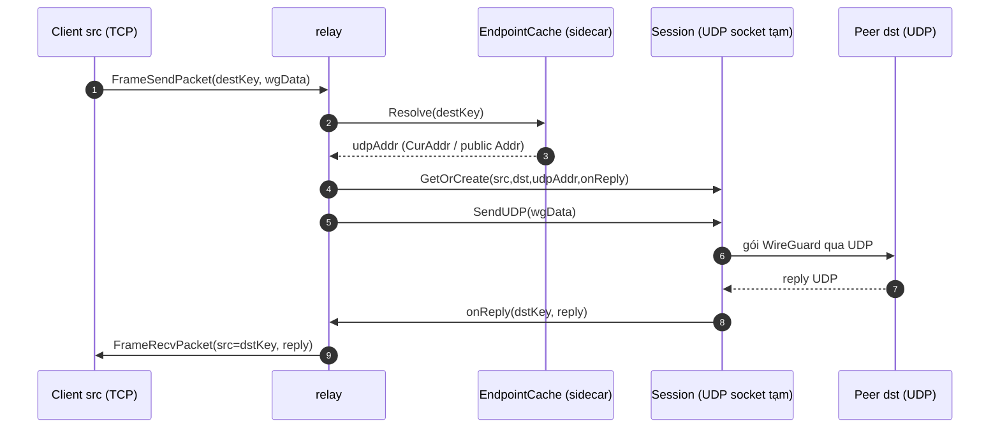

# DERP embed — hybrid relay tự viết (giao thức & call flow)

> Tài liệu giải thích **DERP relay tự viết** (`relay-vpn5/`, dùng lại cho vpn6):
> nó là gì, nói **giao thức DERP** ra sao, và **call flow từng tính năng**.
>
> Nguồn chuẩn: file `.md` này. Bản `DERP-EMBED.html` (cùng thư mục) là bản đọc
> offline, nội dung tương đương.

---

## 0. TL;DR — DERP embed là gì?

Đây **không phải** `derper` chính chủ của Tailscale. Đây là một **DERP relay viết
lại bằng Go** (`relay-vpn5/*.go`), gọi là **hybrid** vì làm 2 việc cùng lúc:

| Phía | Cổng | Việc làm |
|---|---|---|
| **TCP — giao thức DERP v2** | `:8080` (sau TLS của Caddy/Traefik) | Nhận kết nối DERP từ client qua `Upgrade: DERP`, relay gói WireGuard |
| **UDP — cầu WireGuard** | `:41641/udp` | Với peer *có* UDP endpoint, gửi thẳng gói WireGuard qua UDP thay vì relay 2 chặng |

**Vì sao cần?** Đúng kịch bản **công ty chặn UDP (Squid)**: client TCP-only kết nối
relay qua **TCP/443** (được phép), rồi relay tự làm chặng UDP tới peer
UDP-capable → client vẫn đạt hiệu năng *gần direct* thay vì double-relay.

**Bảo mật:** relay **không đọc được nội dung**. Payload là gói WireGuard mã hoá
đầu-cuối (ChaCha20-Poly1305); relay chỉ thấy **public key** để định tuyến. Phần
bắt tay dùng **NaCl box** (curve25519 + xsalsa20 + poly1305) để xác thực client
sở hữu key — không dùng để mã hoá dữ liệu.



---

## 1. Giao thức trao đổi (DERP protocol v2)

### 1.1 Khung tin (frame) — `frame.go`

Mỗi frame = **header 5 byte + payload**:

```
+--------+------------------+----------------------------+
| type   | length (uint32)  | payload (length byte)      |
| 1 byte | 4 byte big-endian|                            |
+--------+------------------+----------------------------+
```

- `length` tối đa `maxFrameSize = 65535 + 64` (gói lớn hơn → lỗi “frame too large”).
- `readFrame`/`writeFrame` đọc/ghi đúng khuôn này.

### 1.2 Bảng frame types

| Hex | Tên | Chiều | Payload |
|---|---|---|---|
| `0x01` | `frameServerKey` | S→C | `magic[8]` + `serverPubKey[32]` |
| `0x02` | `frameClientInfo` | C→S | `clientPubKey[32]` + NaCl box(json) |
| `0x03` | `frameServerInfo` | S→C | NaCl box(json `{version:2}`) |
| `0x04` | `frameSendPacket` | C→S | `destPubKey[32]` + gói WireGuard |
| `0x05` | `frameRecvPacket` | S→C | `srcPubKey[32]` + gói WireGuard |
| `0x06` | `frameKeepAlive` | S→C | (rỗng) — mỗi ~60s |
| `0x07` | `frameNotePreferred` | C→S | `[1]byte` cờ — chỉ thông tin |
| `0x08` | `framePeerGone` | S→C | `peerPubKey[32]` + `[1]byte` lý do |
| `0x12` | `framePing` | cả 2 | `[8]byte` |
| `0x13` | `framePong` | cả 2 | `[8]byte` (echo) |

Magic = `"DERP🔑"` = `44 45 52 50 f0 9f 94 91`. `protocolVersion = 2`.

### 1.3 Bắt tay (handshake) — sequence



---

## 2. Call flow từng tính năng

### F1 — Handshake / connect (`server.go: handleConn`)

1. `Handler()`: nếu path là `/derp/probe` hoặc `/relay/probe` → trả `200 OK` (health).
2. Yêu cầu header `Upgrade: DERP`, nếu không → `426 Upgrade Required`.
3. `Hijack()` lấy TCP conn thô; gửi `101` (trừ khi client bật `DERP-Fast-Start: 1`, Tailscale ≥ v1.86).
4. Gửi `FrameServerKey` → đọc `FrameClientInfo` (deadline 10s) → `OpenFrom` xác thực → gửi `FrameServerInfo`.
5. Đăng ký `clientConn{pubKey, conn, bw}` vào `clients[clientKey]`.
6. `defer`: khi rớt → xoá khỏi `clients` + `sessions.RemoveAll(clientKey)`.

### F2 — Định tuyến gói (`server.go: dispatch → route`) — TÍNH NĂNG CỐT LÕI

`FrameSendPacket` payload = `destPubKey[32]` + `wgData`. `route()` quyết định theo
cây 3 nhánh (mỗi gói đều xét):



- **Option 1 (local TCP)**: cả src và dst đều đang nối DERP ở relay này → relay DERP cổ điển, ghi `FrameRecvPacket` thẳng lên TCP của dst.
- **Option 2 (cầu UDP)**: dst không nối ở đây nhưng có UDP endpoint → relay thay mặt src gửi WireGuard qua UDP, reply về được bơm ngược vào TCP của src dưới dạng `FrameRecvPacket(src=dstKey)`.
- **Option 3**: không có đường → drop (bình thường không xảy ra).



### F3 — Khám phá endpoint (`endpoint.go: EndpointCache`)

- `Run(ctx)`: nền, mỗi `cache-ttl` (mặc định 5s) gọi `refresh` đọc `LocalClient.Status()` của sidecar.
- Phân loại mỗi peer: `CurAddr != "" && Relay == ""` → **UDP-capable**; ngược lại **TCP-only**.
- `Resolve(destKey)` ưu tiên: (1) `CurAddr` (đường UDP đang dùng), (2) endpoint public đầu tiên trong `Addrs` (thử lạc quan). Không có → `(zero, false)` = TCP-only.
- `Invalidate(k)`: xoá cache 1 peer khi UDP send lỗi → lần sau refresh lại.

### F4 — Quản lý session (`session.go: SessionTable`)

- 1 session = 1 cặp `(src, dst)` + **1 UDP socket tạm riêng** (`ListenUDP` port 0). Mỗi cặp 1 socket → reply không lẫn, nhiều session tới cùng dst dùng port nguồn khác nhau.
- `GetOrCreate`: có sẵn thì trả lại (cập nhật `dstAddr` nếu **roaming**); chưa có thì tạo socket + chạy `readLoop`.
- `readLoop`: đọc UDP từ dst; **lọc theo IP nguồn** (chỉ nhận từ đúng dst IP, cho phép đổi *port* do NAT roaming) → `onReply(dstKey, payload)`.
- `Remove` / `RemoveAll`: đóng socket khi xoá 1 session / khi client src rớt.

### F5 — Keepalive & Ping/Pong (`server.go`)

- Vòng chính dùng `kaTicker` 60s → gửi `FrameKeepAlive`. Đọc frame trong goroutine riêng để keepalive vẫn tick khi không có dữ liệu.
- `framePing` (8 byte) → echo `framePong` (8 byte). `frameNotePreferred` → bỏ qua (chỉ thông tin). Frame lạ → bỏ qua (forward-compat).

### F6 — Lưu server key bền (`main.go: loadOrGenKey`)

- Đọc key từ `-key-file` (`/data/relay.key`, volume `relay_data`). Hỏng/không có → sinh `key.NewNode()` rồi ghi (0600).
- **Vì sao quan trọng:** `serverPubKey` trong `FrameServerKey` phải ổn định qua restart, nếu không client sẽ thấy “server lạ”.

### F7 — Health probe & graceful shutdown (`main.go`, `server.go`)

- `GET /derp/probe` hoặc `/relay/probe` → `200 OK` (dùng cho CI/CD và load balancer; vpn6 deploy kiểm `…/relay/probe`).
- `SIGINT`/`SIGTERM` → `httpSrv.Shutdown(5s)` + huỷ context (dừng cache refresh).

---

## 3. Triển khai & transport

| Thành phần | vpn5 | vpn6 |
|---|---|---|
| Reverse proxy TLS | Traefik (`pangolin_network`) | Caddy `memory-caddy` (`memory-stack_memnet`) |
| Cert | Let's Encrypt (Traefik) | Let's Encrypt (Caddy, HTTP-01) |
| Host | `vpn5.hangocthanh.io.vn` | `vpn6.hangocthanh.io.vn` |
| Route | `Host(...) → relay-vpn5:8080` | `reverse_proxy relay-vpn6:8080` |

- **TLS chấm dứt ở proxy**; relay nhận HTTP thường ở `:8080`. WebSocket/`Upgrade` được proxy hỗ trợ sẵn → giao thức DERP đi qua bình thường.
- **UDP 41641** publish ra host (cần mở `ufw 41641/udp`) cho chặng WireGuard.
- **Sidecar tailscale** join tailnet làm node `vpnX`; relay đọc LocalAPI qua socket chia sẻ `ts_sock` để biết endpoint peer.
- **Build**: `golang:1.24-alpine` → binary tĩnh; dùng thư viện `tailscale.com v1.86.0` cho `key`/`ipnstate`/DERP types. vpn6 **dùng lại** `Dockerfile` + `*.go` của vpn5 (chỉ khác hostname & proxy).

### File ↔ chức năng

| File | Chức năng |
|---|---|
| `relay-vpn5/main.go` | khởi tạo, key bền, HTTP server, shutdown |
| `relay-vpn5/server.go` | handshake, dispatch, **route** (3 nhánh), clientConn |
| `relay-vpn5/frame.go` | đọc/ghi frame, hằng số frame types + magic |
| `relay-vpn5/session.go` | SessionTable, UDP socket tạm, readLoop reply, roaming |
| `relay-vpn5/endpoint.go` | EndpointCache: hỏi sidecar ai có UDP endpoint |
| `relay-vpn5/Dockerfile` | build 2 stage (Go → alpine) |
| `relay-vpn5/docker-compose.yml` | relay + sidecar + ping-reporter (vpn5) |
| `relay-vpn6/docker-compose.yml` | dùng lại code vpn5, join `memnet` của Caddy |
| `relay-vpn5/traefik-relay-vpn5.yml`, `relay-vpn6/caddy-vpn6.caddy` | cấu hình reverse proxy |

---

## 4. Di chuyển sang server mới (server migration)

### 4.1 Chuyển một relay (vd vpn5/vpn6) sang VPS mới

1. DNS `vpnX.hangocthanh.io.vn` trỏ IP VPS mới; mở `ufw 41641/udp`.
2. Bảo toàn **`relay_data`** (chứa `relay.key`) nếu muốn giữ nguyên server pubkey →
   client không phải học lại key. Không copy thì relay sinh key mới (client tự cập
   nhật qua DERPMap).
3. Deploy: `docker compose up -d --build` trong `relay-vpnX/`. Sidecar join lại với
   `TS_AUTHKEY`; reverse proxy (Traefik/Caddy) xin cert mới.
4. Cập nhật **DERPMap** (`derp.urls` / dashboard derp-backend) nếu IP/region đổi.
5. Xác minh: `curl -k https://vpnX.../relay/probe` = `OK`; log relay thấy
   `endpoint cache refreshed: N peers`.

### 4.2 Lưu ý transport

- Reverse proxy phải giữ `Upgrade`/WebSocket và **không** đặt timeout ngắn cho
  kết nối DERP (kết nối dài hạn — `ReadTimeout/WriteTimeout = 0`).
- Nếu đổi proxy (Traefik ↔ Caddy), chỉ cần route `Host → relay:8080` và bật
  passthrough header; phần giao thức DERP không đổi.

---

## 5. File liên quan

- `relay-vpn5/*.go` — mã relay (nguồn chân lý của giao thức)
- `relay-vpn5/docker-compose.yml`, `relay-vpn6/docker-compose.yml` — triển khai
- `relay-vpn5/traefik-relay-vpn5.yml`, `relay-vpn6/caddy-vpn6.caddy` — reverse proxy
- `docs/PING-REPORTER.md` — đo latency của các relay này (tài liệu liên quan)
