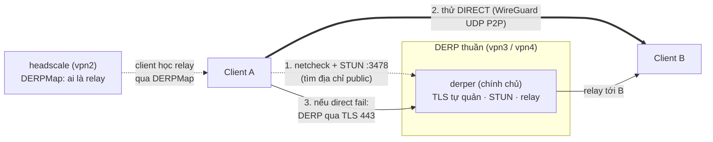
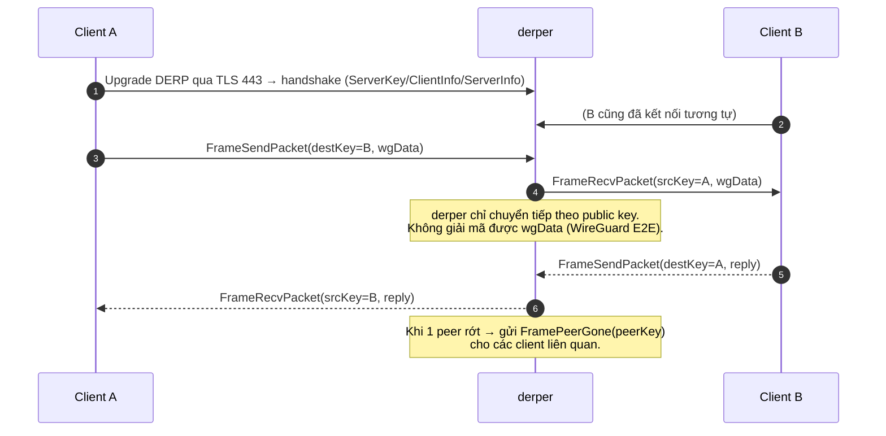
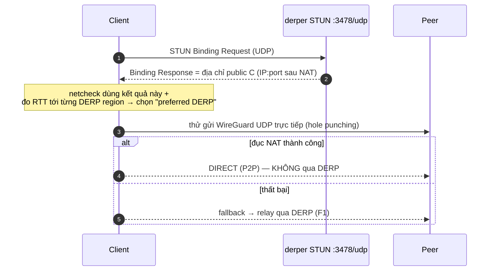

# DERP thuần — `derper` chính chủ (giao thức & call flow)

> Tài liệu giải thích **DERP relay chính chủ của Tailscale** (`derper`) dùng ở
> `derp-vpn3/` và `derp-vpn4/`: nó là gì, hoạt động ra sao, call flow từng tính
> năng — và khác gì với **DERP embed** (bản hybrid tự viết, xem `DERP-EMBED.md`).
>
> Nguồn chuẩn: file `.md` này. Bản `DERP-PURE.html` (cùng thư mục) là bản đọc
> offline, nội dung tương đương.

---

## 0. TL;DR — DERP thuần là gì?

Đây là **`derper` chính chủ** của Tailscale (reference implementation), build từ
source `tailscale.com/cmd/derper`, pin `TAILSCALE_VERSION=v1.80.0`. Nó chạy
**độc lập** (standalone), tự quản TLS, và làm 2 việc cốt lõi của mô hình Tailscale:

| Vai trò | Cổng | Ý nghĩa |
|---|---|---|
| **DERP relay** | `:443` (HTTPS/WebSocket) | Chuyển tiếp gói WireGuard giữa các client **khi không đi direct được** (fallback) |
| **STUN server** | `:3478/udp` | Giúp client phát hiện địa chỉ public của mình để **thử kết nối direct** (đục NAT) |
| ACME HTTP-01 | `:80` | Let's Encrypt xác thực domain để cấp cert |

**Triết lý:** trong Tailscale, **direct (WireGuard UDP P2P) là ưu tiên**, **DERP
là dự phòng**. STUN của derper giúp client đi direct; chỉ khi không đục được NAT thì
lưu lượng mới chạy qua DERP. (DERP embed mới là bản đặc biệt cho mạng chặn UDP —
xem so sánh ở §5.)

**Bảo mật:** giống mọi DERP, derper **không đọc được nội dung** — payload là gói
WireGuard mã hoá đầu-cuối (ChaCha20-Poly1305); derper chỉ thấy public key để định
tuyến. `--verify-clients=false` ở đây = relay **mở** (ai cũng dùng được, dữ liệu vẫn
an toàn); có thể siết lại theo tailnet (xem F4).



---

## 1. Giao thức

DERP thuần nói **đúng giao thức DERP v2** — vì nó *chính là* bản tham chiếu mà
DERP embed mô phỏng. Phần khung tin (frame 5-byte header + payload), bảng frame
types, magic `DERP🔑`, và handshake 5 bước **giống hệt** tài liệu
[`DERP-EMBED.md`](DERP-EMBED.md) §1 — không lặp lại ở đây.

Điểm **khác biệt** của bản thuần so với embed nằm ở *transport* và *tính năng*,
không phải ở frame:

| Khía cạnh | DERP thuần (`derper`) | DERP embed (hybrid) |
|---|---|---|
| Kết thúc TLS | **chính derper** (`--certmode=letsencrypt`) | reverse proxy (Caddy/Traefik) |
| STUN | **có** (`--stun --stun-port=3478`) | không |
| Cầu UDP→peer | **không** (chỉ relay client↔client) | có (gửi WireGuard qua UDP) |
| Lắng nghe | `:443`, `:80`, `:3478/udp` trực tiếp | `:8080` sau proxy + `:41641/udp` |
| Kiểm soát truy cập | `--verify-clients` (tùy chọn) | không |

---

## 2. Call flow từng tính năng

### F1 — Relay gói giữa client (chức năng DERP cốt lõi)

derper là một **switchboard mã hoá**: client kết nối, gửi gói kèm public key đích,
derper chuyển tới client đích đang nối.



- Nhiều client cùng nối 1 derper tạo thành **mesh sao** (star): mọi gói qua trung
  tâm derper. (derper còn hỗ trợ **mesh giữa nhiều DERP server** qua mesh key —
  triển khai này chạy **1 node/region, không bật mesh**.)
- derper gửi `FrameKeepAlive` định kỳ; phát `FramePeerGone` khi 1 peer ngắt.

### F2 — STUN server (`--stun --stun-port=3478`) — bệ phóng cho DIRECT

Đây là tính năng **giúp tránh** phải dùng DERP. Client cần biết địa chỉ
`IP:port` *công khai* của mình (sau NAT) để bên kia gửi gói UDP trực tiếp.



- STUN trả lời rất nhẹ (1 request/response UDP), là một phần của **netcheck** mà
  client chạy để chọn DERP gần nhất và để hole-punch.
- Vì vậy 1 DERP server tốt vừa **relay** vừa **chạy STUN** — đó là lý do bật
  `--stun`.

### F3 — TLS / cấp chứng chỉ (`--certmode=letsencrypt`)

Khác DERP embed (proxy lo TLS), **derper tự xin và tự phục vụ cert**.

```mermaid
sequenceDiagram
  autonumber
  participant D as derper
  participant LE as Let's Encrypt
  participant ACME as Truy vấn HTTP-01 (cổng 80)
  Note over D: --hostname=vpn3.hangocthanh.io.vn (PHẢI khớp DNS → IP VPS)
  D->>LE: yêu cầu cert cho hostname
  LE->>ACME: thử thách HTTP-01 tại http://vpn3.../.well-known/acme-challenge/...
  ACME-->>LE: derper (cổng 80) trả lời đúng token
  LE-->>D: cấp cert → lưu vào --certdir=/data/derper-certs (volume)
  Note over D: phục vụ HTTPS/DERP trên :443 bằng cert này;<br/>tự gia hạn trước hạn.
```

- Cần: DNS `--hostname` trỏ đúng IP VPS, **cổng 80 và 443 mở** ra Internet.
- Cert nằm trong volume `derper_certs` → sống qua restart, không xin lại liên tục.

### F4 — Kiểm soát truy cập (`--verify-clients`)

| Giá trị | Hành vi | Khi nào dùng |
|---|---|---|
| `false` *(hiện tại)* | DERP **mở** — bất kỳ client nào cũng relay được. Dữ liệu vẫn an toàn (WireGuard E2E). | đơn giản, hiệu năng, không lộ nội dung |
| `true` + `--verify-clients-url=https://vpn2...` | derper hỏi headscale: client này có thuộc tailnet không → chỉ phục vụ node hợp lệ | muốn chống lạm dụng băng thông relay bởi node lạ |

> Hiện cả vpn3/vpn4 đặt `--verify-clients=false` (ghi rõ trong compose). Muốn siết
> thì bật `true` + URL control server; đây là thay đổi hành vi → cần plan/duyệt riêng.

### F5 — Đăng ký vào headscale DERPMap (client học được relay này)

derper chỉ hữu ích khi client **biết nó tồn tại**. Client lấy danh sách relay từ
**DERPMap** do headscale (vpn2) phát:

- headscale lấy DERPMap **động** từ `derp-backend` (Neon Postgres, bảng
  `derp_servers`) qua `derp.urls: [http://derp-backend:8787/derpmap.json]`
  trong `config/config.yaml` (`derp.paths: []` — không load file tĩnh nào
  trong `config/`). `auto_update_enabled: true` khiến headscale tự
  `GET` lại endpoint này mỗi `update_frequency` (~10s); mỗi DERP region
  khai báo `hostname`, port, có STUN hay không.
- Client `tailscaled` tải DERPMap → netcheck (F2) đo RTT từng region → chọn
  **preferred DERP** → khi cần fallback thì kết nối relay đó (F1).
- Region code (vd `vpn3-vn`, `vpn4-vn`) chính là nhãn hiển thị trên dashboard và
  khớp với `REPORTER_NAME` của ping-reporter.

### F6 — Quan hệ với sidecar & ping-reporter (giám sát)

**Quan trọng:** trong `derp-vpn3/`/`derp-vpn4/` có thêm container `tailscale`
(sidecar) và `ping-reporter`, nhưng **derper KHÔNG cần sidecar để relay**. derper
là relay công khai, hoạt động độc lập. Sidecar chỉ để:

- join tailnet làm node `vpn3`/`vpn4` (xuất hiện trong dashboard),
- cho `ping-reporter` đo latency relay→peer và POST về collector (xem
  [`PING-REPORTER.md`](PING-REPORTER.md)).

→ Nếu sidecar/ping-reporter chết, **relay vẫn chạy bình thường**, chỉ mất số liệu
giám sát của node đó. (Trái lại, DERP embed *cần* sidecar để biết UDP endpoint.)

---

## 3. Triển khai

### Tham số `derper` (vpn3 — vpn4 chỉ khác hostname)

```
--hostname=vpn3.hangocthanh.io.vn   # PHẢI khớp DNS → IP VPS
--a=:443                            # HTTPS / DERP WebSocket
--http-port=80                     # ACME HTTP-01 + HTTP
--certmode=letsencrypt             # derper tự quản TLS
--certdir=/data/derper-certs       # volume derper_certs (giữ cert qua restart)
--stun                             # bật STUN server
--stun-port=3478                   # cổng STUN (UDP)
--verify-clients=false             # relay mở (xem F4)
```

### Cổng & build

- **Cổng mở ra Internet:** `80/tcp` (ACME), `443/tcp` (HTTPS+DERP), `3478/udp` (STUN).
- **Build:** `golang:1.23-alpine` → `go install tailscale.com/cmd/derper@v1.80.0`
  → runtime `alpine:3.20` + `ca-certificates`. **Pin version** để CI/deploy tái tạo
  image y hệt.
- **Không secret:** DERP thuần không cần key/secret (`.env.example` chỉ ghi tham
  khảo `DERP_DOMAIN`). vpn4 dùng lại `Dockerfile.derper` của vpn3.

### Di chuyển sang server mới (server migration)

1. DNS `vpnN.hangocthanh.io.vn` trỏ **IP VPS mới**; mở `80/tcp`, `443/tcp`,
   `3478/udp` ở firewall/cloud.
2. `docker compose up -d --build` trong `derp-vpnN/`. derper **tự xin cert mới**
   qua ACME (cần cổng 80 reachable). Không bắt buộc copy volume cert — sẽ cấp lại.
3. Cập nhật **DERPMap** qua Dashboard DERP UI hoặc API (`PATCH /api/derp/:regionId`)
   nếu IP/region đổi (để client học relay mới) — không sửa file YAML nào, và
   **không cần restart headscale**: `auto_update_enabled` tự refetch từ
   `derp-backend` mỗi ~10s. DNS giữ nguyên hostname thì client tự kết nối lại
   sau khi DNS trỏ IP mới.
4. (Tùy chọn) copy volume `tailscale_vpnN` để sidecar giữ identity node giám sát.
5. Xác minh: `curl -I https://vpnN.hangocthanh.io.vn` (cert hợp lệ); client
   `tailscale netcheck` thấy region; dashboard có latency.

---

## 4. File ↔ chức năng

| File | Chức năng |
|---|---|
| `derp-vpn3/Dockerfile.derper` | build derper chính chủ (pin `v1.80.0`) |
| `derp-vpn3/docker-compose.yml` | derper + sidecar + ping-reporter (vpn3) |
| `derp-vpn4/docker-compose.yml` | tương tự, dùng lại Dockerfile vpn3 |
| `derp-vpn3/.env.example` | tham khảo `DERP_DOMAIN` (không secret) |

---

## 5. DERP thuần vs DERP embed — chọn cái nào?

| Tiêu chí | **DERP thuần** (`derper`) | **DERP embed** (hybrid) |
|---|---|---|
| Bản chất | relay chính chủ + STUN | relay tự viết + cầu UDP |
| Mạng chặn UDP (Squid)? | client vẫn vào được (DERP qua 443), nhưng peer-to-peer vẫn fallback DERP 2 chặng | **tối ưu**: relay tự đi UDP tới peer → gần direct |
| STUN/NAT traversal | **có** — giúp client đi direct | không (giả định mạng đã chặn UDP) |
| TLS | tự quản | sau reverse proxy |
| Độ phức tạp vận hành | thấp (1 binary chính chủ) | cao hơn (code riêng + proxy) |
| Khi nào dùng | DERP region phổ thông cho cả tailnet | điểm vào cho mạng chặn UDP cứng |

> Tóm lại: **derper** là xương sống DERP tiêu chuẩn (mọi node hưởng lợi từ STUN +
> fallback). **embed** là giải pháp đặc thù đặt ở rìa mạng bị chặn UDP. Hai cái bổ
> sung cho nhau, không thay thế.

---

## 6. Tài liệu liên quan

- [`DERP-EMBED.md`](DERP-EMBED.md) — hybrid relay tự viết (giao thức v2 chi tiết + cầu UDP)
- [`PING-REPORTER.md`](PING-REPORTER.md) — đo latency của các DERP node này
