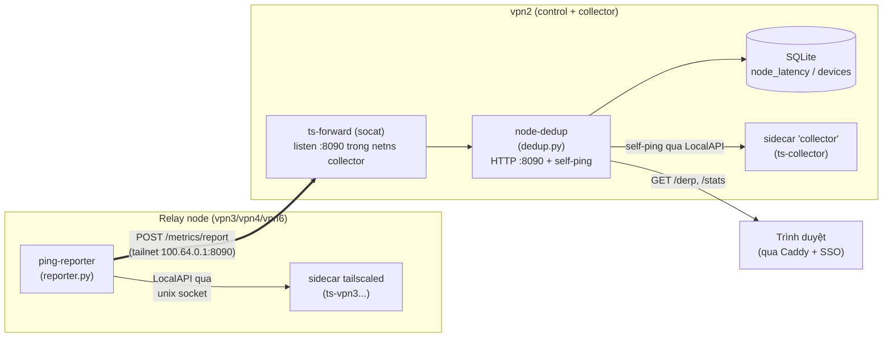
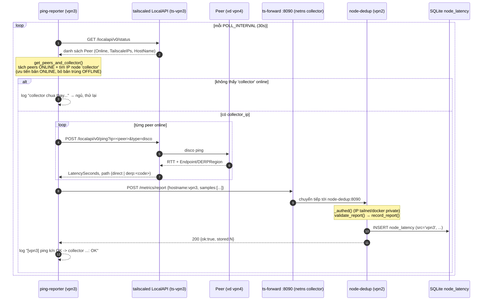
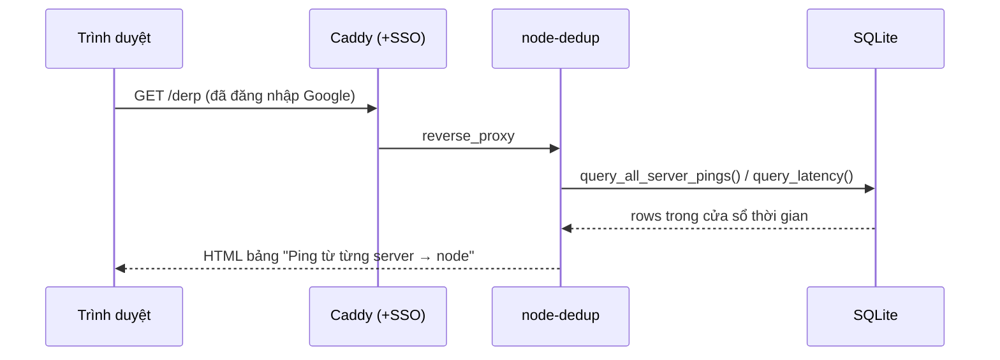

# Ping-reporter — cách chạy, sequence & call flow

> Tài liệu giải thích cơ chế đo độ trễ (latency) giữa các node trong tailnet và
> vì sao dashboard `/derp` đôi khi chỉ hiện **vpn2** còn **vpn3/vpn4/vpn5/vpn6**
> báo *"ping-reporter chưa chạy"*.
>
> Nguồn chuẩn: file `.md` này. Bản `PING-REPORTER.html` (cùng thư mục) là bản đọc
> offline, nội dung tương đương.

---

## 0. TL;DR — vì sao chỉ có vpn2 có số?

Bảng *"Ping từ từng server → node"* trên dashboard gộp **2 nguồn khác nhau** vào
chung 1 bảng SQLite `node_latency`:

| Nguồn hiển thị | Ai tạo ra | Chạy ở đâu | Phụ thuộc gì |
|---|---|---|---|
| **vpn2** | `node-dedup` **tự ping** (`SRC_NAME=collector`) | trên vpn2 | luôn có, không cần reporter |
| **vpn3 / vpn4 / vpn6** | container **`ping-reporter`** | trên *chính* node đó | cần reporter chạy + POST về được collector |
| **vpn5** | *(chưa có)* | — | repo `relay-vpn5`/`derp-vpn5` **chưa có** service `ping-reporter` |

→ **vpn2 luôn có số** vì đó là collector tự đi ping mọi node qua LocalAPI của
sidecar. Các hàng còn lại trống khi **reporter trên node đó chưa chạy / chưa POST
được về collector**. vpn5 sẽ *luôn* trống cho tới khi thêm service reporter.

Một hàng (vd `vpn3`) chỉ có số khi đủ **5 mắt xích**:

1. container `ping-reporter-vpn3` đang chạy trên vpn3
2. sidecar `ts-vpn3` đã join tailnet (có IP `100.64.x.y`)
3. reporter tìm thấy peer tên `collector` **ONLINE** qua LocalAPI
4. `ts-forward` (socat trong netns collector của vpn2) còn sống
5. `node-dedup` trên vpn2 còn sống

---

## 1. Kiến trúc tổng quan

Có **hai chiều đo** đổ vào cùng một bảng `node_latency`, rồi dashboard đọc ra.



- **Reporter (chiều 1)** chạy *trên relay node*, POST kết quả về vpn2 → nguồn
  `vpn3/vpn4/vpn6`.
- **Self-ping (chiều 2)** chạy *trên vpn2* (trong `node-dedup`), tự ping mọi node
  → nguồn `collector`, hiển thị nhãn **vpn2**.

> **Vì sao cần `ts-forward`?** `node-dedup` đã **tách khỏi** netns của sidecar
> (chạy như container riêng để `/stats` luôn sống kể cả khi sidecar restart). Nên
> nó **không còn IP tailnet**. `ts-forward` (socat) chạy *trong* netns sidecar
> `collector` (có IP tailnet `100.64.0.1`), lắng nghe `:8090` rồi forward sang
> `node-dedup:8090`. Reporter POST tới `100.64.0.1:8090` → tới được node-dedup.

---

## 2. Sequence — một vòng poll của reporter (mặc định 30s)



Dashboard đọc độc lập (mỗi 30s tự refresh):



---

## 3. Call flow chi tiết (hàm ↔ biến môi trường)

### 3.1 Phía reporter — `ping-reporter/reporter.py`

| Bước | Hàm | Việc làm | Biến môi trường liên quan |
|---|---|---|---|
| 1 | `get_peers_and_collector()` | `GET /localapi/v0/status` qua unix socket → tách peers ONLINE + IP node `collector` (ưu tiên ONLINE) | `TS_SOCKET` |
| 2 | `ping_peer(ip4)` | `POST /localapi/v0/ping?ip=…&type=disco`; tính `rtt_ms`, `path` (`direct` nếu có `Endpoint`, ngược lại `derp:<region>`) | `PING_TIMEOUT` |
| 3 | `post_to_collector(ip, samples)` | `POST http://<collector_ip>:<port>/metrics/report` với `{hostname, ipv4:"", mac:"", samples}` | `COLLECTOR_PORT` |
| 4 | `main()` | vòng lặp vô hạn, ngủ giữa các vòng; nhãn nguồn = `REPORTER_NAME` | `REPORTER_NAME`, `POLL_INTERVAL` |

Hằng số: `COLLECTOR_HOSTNAME = "collector"` (tên node headscale của vpn2).
Payload mẫu gửi đi:

```json
{
  "hostname": "vpn3",
  "ipv4": "",
  "mac": "",
  "samples": [
    {"dst": "vpn4", "dst_ip": "100.64.0.4", "rtt_ms": 95.6, "path": "derp:vpn4-vn", "ok": true}
  ]
}
```

### 3.2 Phía collector — `node-dedup/dedup.py`

| Bước | Hàm | Việc làm |
|---|---|---|
| A | `make_metrics_handler().do_POST` | route `/metrics/report`; `_authed()` = `is_allowed_report_src(ip)` (tailnet/loopback **hoặc** dải docker riêng — vì socat làm mất IP tailnet gốc) |
| B | `validate_report(body)` | kiểm tra/định dạng `samples` |
| C | `record_report(conn, report, now)` | cập nhật `devices.mac` (nếu có) + `INSERT node_latency` với `src = report["hostname"]` |
| D | *self-ping loop* `server_ping_all(nodes)` → `record_samples(…, SRC_NAME="collector")` | vpn2 tự ping mọi node ONLINE qua LocalAPI sidecar — **nguồn `vpn2`** |
| E | `do_GET /derp` → `query_all_server_pings()` → `render_derp_html()` | render bảng; `_code_to_src`: `myderp→collector`, còn lại cắt hậu tố địa lý `-vn`/`-us` |

**Quy tắc nhãn dashboard** (`render_derp_html`): với mỗi DERP region, nếu không có
dữ liệu và `src_key != "collector"` → in *"ping-reporter chưa chạy"*; nếu là
`collector` (nhãn vpn2) → chỉ in *"chưa có dữ liệu"*.

---

## 4. Cấu hình mỗi node

Mỗi relay node khai báo service `ping-reporter` trong compose của nó
(`derp-vpn3/`, `derp-vpn4/`, `relay-vpn6/`):

```yaml
ping-reporter:
  image: python:3.12-slim
  container_name: ping-reporter-vpn3        # đổi theo node
  restart: unless-stopped
  network_mode: "service:tailscale"          # BẮT BUỘC: dùng chung netns sidecar
  command: ["python3", "/app/reporter.py"]
  environment:
    - REPORTER_NAME=vpn3                      # PHẢI khớp DERP region code của node
    - TS_SOCKET=/var/run/tailscale/tailscaled.sock
    - POLL_INTERVAL=30
    - COLLECTOR_PORT=8090
    - PING_TIMEOUT=8
  volumes:
    - ../ping-reporter/reporter.py:/app/reporter.py:ro
    - ts_sock:/var/run/tailscale                # socket LocalAPI chia sẻ
  depends_on:
    - tailscale
```

Điểm quan trọng:

- **`network_mode: "service:tailscale"`** — reporter dùng *chung* netns với sidecar
  nên có IP tailnet để POST tới `collector:8090` qua WireGuard. Thiếu cái này thì
  POST timeout.
- **`REPORTER_NAME`** phải trùng DERP region code của node (vpn3/vpn4/vpn6) thì
  dashboard mới ghép đúng hàng. Sai tên ⇒ dữ liệu vào DB nhưng không hiện ở hàng
  mong đợi.
- **`ts_sock` volume** — socket `tailscaled.sock` chia sẻ giữa sidecar và reporter.

---

## 5. Troubleshooting — hàng trống thì kiểm tra gì

| Triệu chứng | Nguyên nhân khả dĩ | Cách kiểm tra |
|---|---|---|
| Hàng `vpn3/vpn4/vpn6` trống | container reporter chưa chạy | `docker ps \| grep ping-reporter-vpnX` ; `docker logs ping-reporter-vpnX` |
| Log: `collector chua thay trong tailnet` | sidecar chưa join / node `collector` (vpn2) offline | `docker exec ts-vpnX tailscale status` ; kiểm tra vpn2 |
| Log: `POST collector ERR` | `ts-forward` chết hoặc `node-dedup` chết trên vpn2 | trên vpn2: `docker ps \| grep -E 'ts-forward\|node-dedup'` |
| Log: `khong co peer online ngoai collector` | thật sự không có peer nào online | bình thường nếu tailnet trống |
| Hàng `vpn5` luôn trống | **chưa có** service reporter trong `relay-vpn5`/`derp-vpn5` | thêm service `ping-reporter` (đang hoãn theo yêu cầu) |
| Hàng `vpn2` cũng trống | `node-dedup` hoặc sidecar `collector` chết | trên vpn2: `docker logs node-dedup` |

**Kiểm tra nhanh toàn cục** (smoke gate dùng trong deploy):

```bash
# trên vpn2 (hoặc qua Caddy nội bộ) — 503 + danh sách 'stale' nếu reporter chưa báo
curl -s 'http://node-dedup:8090/metrics/health?expect=vpn3,vpn4,vpn6&window=180'
# {"ok":true,"stale":[],...}  hoặc  {"ok":false,"stale":["vpn4"],...}
```

`deploy.yml` gọi đúng endpoint này sau khi deploy: nếu reporter nào "stale" thì
job FAIL (đỏ) thay vì hỏng âm thầm.

---

## 6. Di chuyển sang server mới (server migration)

### 6.1 Chuyển một relay node (vd vpn3) sang VPS mới

1. DNS `vpn3.hangocthanh.io.vn` trỏ về IP VPS mới (relay/derper tự xin lại cert).
2. Chạy workflow deploy của node đó (hoặc `docker compose up -d --build` trong
   thư mục `derp-vpn3/`). Service `ping-reporter` tự khởi động lại.
3. **Không cần đổi gì** ở phía collector: reporter tìm collector theo *hostname*
   `collector` qua LocalAPI, không hardcode IP. `REPORTER_NAME=vpn3` giữ nguyên ⇒
   dashboard tiếp tục ghép đúng hàng.
4. Xác minh: `docker logs ping-reporter-vpn3` thấy `... -> collector ...: OK` và
   `curl .../metrics/health?expect=vpn3&window=180` trả `ok:true`.

### 6.2 Chuyển collector / vpn2 sang server mới

1. Lịch sử latency & MAC nằm trong volume `dedup_data` (`/data/devices.db`) — copy
   volume nếu muốn giữ lịch sử; không copy thì DB khởi tạo trống (reporter sẽ điền
   lại sau vài vòng).
2. Sau khi vpn2 mới chạy: sidecar `ts-collector` join lại với hostname
   `collector`, `ts-forward` mở `:8090` trong netns đó, `node-dedup` lắng nghe.
3. **Reporter các node không cần sửa**: chúng tự khám phá lại peer `collector`
   ONLINE và POST về IP tailnet mới. (Nếu có node `collector` cũ OFFLINE còn sót,
   reporter đã ưu tiên bản ONLINE — xem `get_peers_and_collector`.)
4. Dọn node `collector` trùng OFFLINE: `node-dedup` tự gom/xoá bản trùng OFFLINE.

---

## 7. File liên quan

- `ping-reporter/reporter.py` — mã reporter (chạy trên relay node)
- `ping-reporter/test_reporter.py` — unit test (gồm test ưu tiên collector ONLINE)
- `node-dedup/dedup.py` — collector: nhận `/metrics/report`, self-ping, render dashboard
- `derp-vpn3/docker-compose.yml`, `derp-vpn4/docker-compose.yml`,
  `relay-vpn6/docker-compose.yml` — khai báo service `ping-reporter` mỗi node
- `docker-compose.yml` (vpn2) — `node-dedup` + sidecar `collector` + `ts-forward`
- `.github/workflows/deploy.yml` — smoke gate `/metrics/health`
