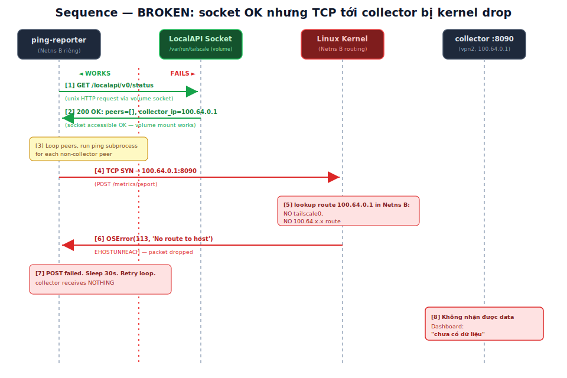
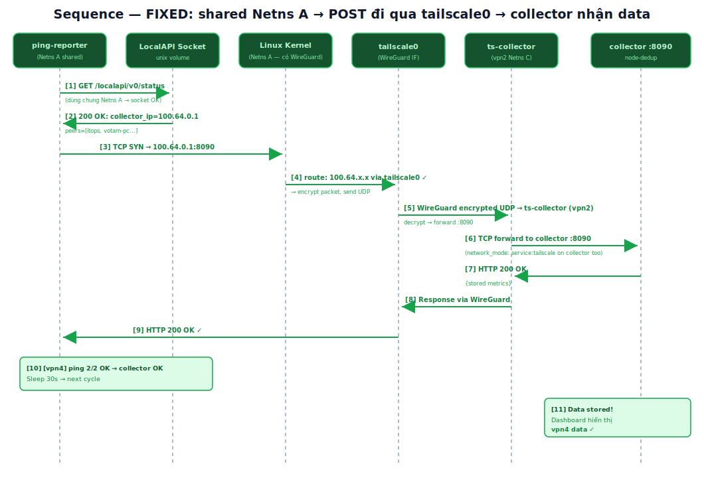
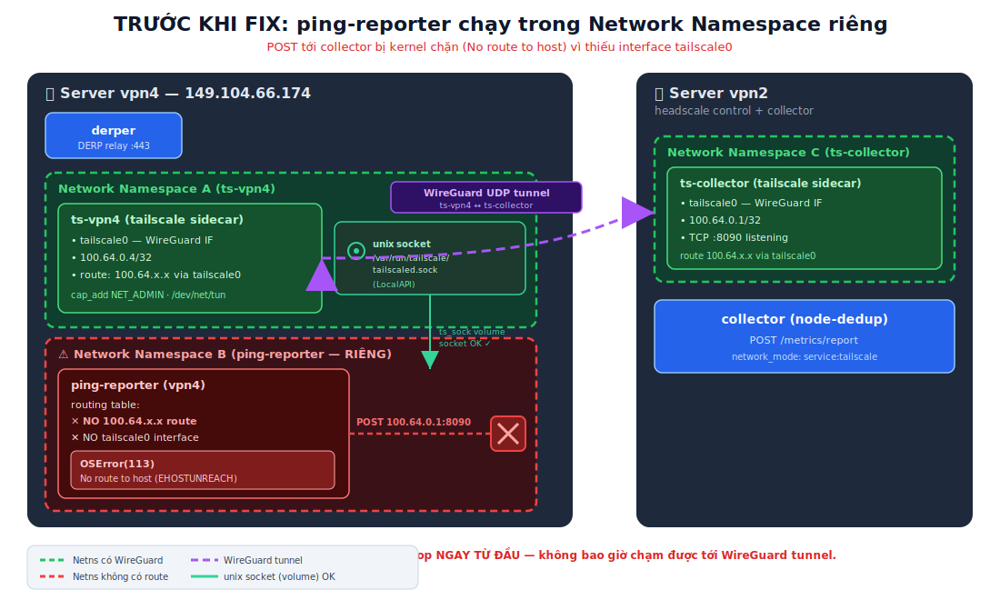
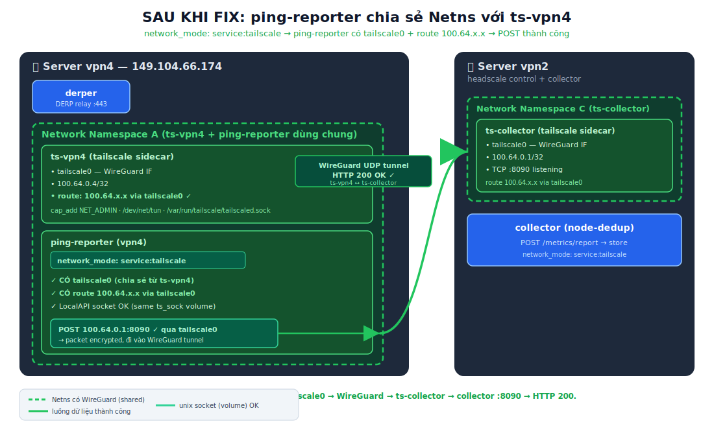
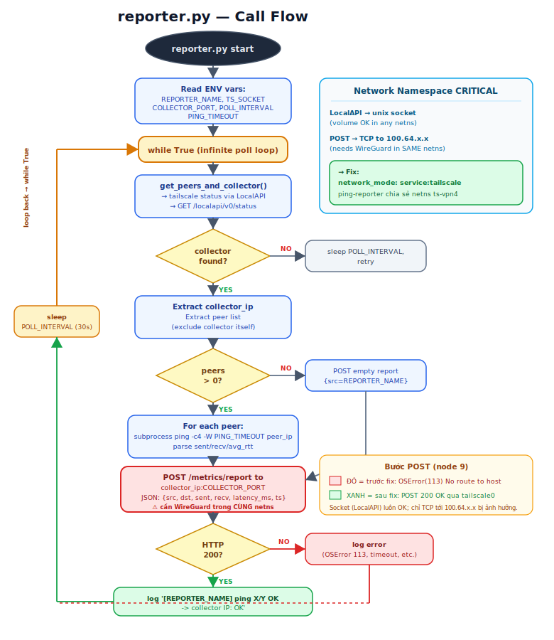

# Bug Fix: ping-reporter — OSError(113) do Network Namespace Isolation

> Tài liệu kỹ thuật cho dự án **deployHeadscale** (self-hosted Tailscale/Headscale VPN).
> Phiên bản: 1.0 · Cập nhật: 2026-06-19 · Trạng thái: ĐÃ FIX & CI PASS.

---

## Tóm tắt

Dashboard hiển thị `chưa có dữ liệu — ping-reporter chưa chạy` cho node **vpn4**.
Nguyên nhân **KHÔNG PHẢI** do ping-reporter crash, mà do **Docker Network Namespace Isolation**:

- Mỗi container Docker mặc định có **network namespace (netns)** riêng.
- Interface WireGuard `tailscale0` (chứa route tới dải `100.64.x.x`) chỉ tồn tại **bên trong netns của ts-vpn4**.
- `ping-reporter` chạy trong **netns riêng của nó** → **không có** `tailscale0`, **không có** route `100.64.x.x`.
- Khi `reporter.py` gọi `POST http://100.64.0.1:8090/metrics/report`, kernel của netns đó trả về `OSError(113, 'No route to host')` (EHOSTUNREACH).
- Đáng chú ý: **LocalAPI socket vẫn OK** (vì nó được mount qua *volume*, không phụ thuộc netns). Chỉ riêng kết nối **TCP tới `100.64.x.x`** mới bị chặn — điều này gây hiểu nhầm "tailscale hoạt động bình thường".

**Cách fix (1 dòng):** thêm `network_mode: "service:tailscale"` cho `ping-reporter` trong `derp-vpn4/docker-compose.yml` để nó **chia sẻ netns với ts-vpn4**, nhờ đó có `tailscale0` và route `100.64.x.x`.

**Bằng chứng:**

| Thời điểm | Log diag |
|-----------|----------|
| Trước fix | `POST collector ERR: OSError(113, 'No route to host')` |
| Sau fix   | `[vpn4] ping 2/2 OK -> collector 100.64.0.1: OK` |

Ngoài ra có một lỗi CI liên quan (`relay-vpn5-integration`) do thiếu `go.sum` — xem **Mục 8**.

---

## 1. Kiến trúc hệ thống

Dự án gồm hai server chính:

### vpn2 — Control plane
- **headscale**: control server quản lý ACL, key, node registration.
- **ts-collector**: tailscale *sidecar* (địa chỉ tailnet `100.64.0.1`). Chạy trong netns riêng (gọi là **Netns C**).
- **collector (node-dedup)**: ứng dụng lắng nghe `:8090` **bên trong netns của ts-collector** (dùng `network_mode: service:tailscale`), nhận `POST /metrics/report` và lưu trữ, deduplicate metric theo node.

### vpn4 — DERP relay + ping-reporter
- **derper**: DERP relay (`:443`) giúp các node NAT-traversal khi không thể kết nối trực tiếp.
- **ts-vpn4**: tailscale *sidecar* (địa chỉ tailnet `100.64.0.4`). Chạy trong netns riêng (**Netns A**).
- **ping-reporter**: tiến trình Python (`reporter.py`) định kỳ:
  1. Lấy danh sách peer + IP collector từ **LocalAPI** (`GET /localapi/v0/status`) qua unix socket.
  2. `ping` từng peer, đo `sent/recv/avg_rtt`.
  3. `POST` kết quả tới `collector` ở `100.64.0.1:8090`.

### Bảng địa chỉ

| Thành phần | Server | Tailnet IP | Cổng | Netns |
|------------|--------|-----------|------|-------|
| ts-collector | vpn2 | 100.64.0.1 | 8090 (collector listen) | Netns C |
| collector (node-dedup) | vpn2 | (dùng netns C) | 8090 | Netns C (shared) |
| ts-vpn4 | vpn4 | 100.64.0.4 | — | Netns A |
| ping-reporter | vpn4 | (dùng netns A sau fix) | — | Netns A (shared sau fix) |
| derper | vpn4 | (netns mặc định) | 443 | riêng |

> **Khái niệm sidecar pattern:** container `tailscale` chịu trách nhiệm về mạng tailnet; các container "app" (collector, ping-reporter) **mượn** netns của nó bằng `network_mode: service:tailscale`. Đây là pattern chuẩn để app nói chuyện qua tailnet mà không cần tự cài tailscaled.

---

## 2. Vấn đề: Docker Network Namespace Isolation

**Network namespace** là cơ chế của Linux kernel để cô lập stack mạng: mỗi netns có **bảng interface riêng**, **bảng route riêng**, **iptables riêng**, **socket TCP/UDP riêng**.

Mặc định, mỗi container Docker được cấp **một netns mới**. Hệ quả:

- `tailscale0` (interface WireGuard do `tailscaled` tạo) chỉ "nhìn thấy được" trong netns nơi `tailscaled` chạy → tức **Netns A (ts-vpn4)**.
- Bảng route trong Netns A có dòng đại loại:
  ```
  100.64.0.0/10 dev tailscale0 scope link
  ```
- `ping-reporter` ở **Netns B** (netns riêng của nó) **KHÔNG** có interface `tailscale0`, **KHÔNG** có dòng route trên → mọi gói tin gửi tới `100.64.x.x` đều "không biết đi đường nào".

### Tại sao LocalAPI socket vẫn OK còn TCP thì hỏng?

Đây là điểm dễ gây nhầm lẫn nhất:

| Kênh giao tiếp | Cơ chế | Phụ thuộc netns? | Kết quả trong Netns B |
|----------------|--------|------------------|-----------------------|
| LocalAPI (`/var/run/tailscale/tailscaled.sock`) | **unix domain socket** mount qua *volume* `ts_sock` | ❌ Không | ✅ Hoạt động — đọc status bình thường |
| `POST` tới `100.64.0.1:8090` | **TCP/IP** qua interface mạng | ✅ Có | ❌ `OSError(113) No route to host` |

Unix socket là một **file** trên filesystem; chỉ cần file đó được mount vào container là dùng được, **không cần** đi qua interface mạng. Vì thế `tailscale status` chạy ngon nhưng `POST` thì chết — tạo cảm giác "tailscale vẫn chạy mà sao reporter không gửi được data".

Xem sơ đồ kiến trúc **trạng thái lỗi** ở Mục 6.1 và sequence diagram ở Mục 5.1.

---

## 3. Phân tích nguyên nhân gốc rễ

Quá trình debug theo phương pháp **CI test cases tái lập được** (không click-and-report thủ công):

1. **Triệu chứng:** Dashboard cho vpn4 trống; các node khác (chạy reporter cùng netns hoặc cùng host) thì có data.
2. **Loại trừ "reporter crash":** kiểm tra `docker logs ping-reporter-vpn4` → tiến trình **vẫn chạy**, vòng lặp poll vẫn quay, nhưng mỗi vòng đều log `POST collector ERR: OSError(113, 'No route to host')`.
3. **Loại trừ "LocalAPI hỏng":** trong cùng log thấy `GET /localapi/v0/status` trả `200 OK`, đọc được peer list + `collector_ip=100.64.0.1`. → Socket OK.
4. **Khoanh vùng "thiếu route":** chạy diag bên trong netns của ping-reporter:
   ```
   $ ip addr            # KHÔNG có tailscale0
   $ ip route get 100.64.0.1
   RTNETLINK answers: No route to host
   ```
5. **Đối chiếu netns:** so với ts-vpn4 — interface `tailscale0` và route `100.64.0.0/10` chỉ có trong netns của ts-vpn4.
6. **Kết luận root cause:** ping-reporter và ts-vpn4 **không cùng netns** → reporter không thể định tuyến tới tailnet. Mã nguồn `reporter.py` **đúng**; vấn đề thuần túy ở **cấu hình mạng Docker**.

`OSError(113)` (errno `EHOSTUNREACH`) được kernel sinh ra **ngay tại bước tra route** — gói tin còn chưa rời máy, nên nó **không bao giờ chạm tới WireGuard tunnel**. Đây là khác biệt quan trọng so với lỗi firewall (timeout) hay lỗi DNS.

---

## 4. Giải pháp

Cho `ping-reporter` **chia sẻ network namespace** với container `tailscale` (ts-vpn4) bằng `network_mode: "service:tailscale"`.

`derp-vpn4/docker-compose.yml` (phần liên quan):

```yaml
services:
  tailscale:                           # ts-vpn4: Network Namespace A
    container_name: ts-vpn4
    image: tailscale/tailscale:latest
    volumes:
      - ts_sock:/var/run/tailscale     # volume chứa unix socket
    devices:
      - /dev/net/tun
    cap_add:
      - NET_ADMIN

  ping-reporter:                       # FIX: dùng chung Netns A
    image: python:3.12-slim
    container_name: ping-reporter-vpn4
    network_mode: "service:tailscale"  # <-- KEY FIX: share ts-vpn4's netns
    environment:
      - REPORTER_NAME=vpn4
      - TS_SOCKET=/var/run/tailscale/tailscaled.sock
      - POLL_INTERVAL=30
      - COLLECTOR_PORT=8090
    volumes:
      - ../ping-reporter/reporter.py:/app/reporter.py:ro
      - ts_sock:/var/run/tailscale    # same socket volume
    depends_on:
      - tailscale
```

### Tại sao fix này đúng

Khi dùng `network_mode: "service:tailscale"`:

- Docker **không tạo netns mới** cho ping-reporter; thay vào đó nó **gắn ping-reporter vào netns của ts-vpn4 (Netns A)**.
- Ping-reporter lập tức "nhìn thấy" interface `tailscale0` và bảng route `100.64.0.0/10 dev tailscale0`.
- `POST http://100.64.0.1:8090` giờ được kernel định tuyến qua `tailscale0` → mã hóa WireGuard → gửi UDP tới ts-collector (vpn2) → giải mã → forward `:8090`.

### Lưu ý quan trọng khi dùng `network_mode: service:<x>`

1. **Không khai báo `ports:`** trên container chia sẻ netns — port mapping phải đặt trên container "chủ" (tailscale). Docker sẽ báo lỗi nếu bạn vừa dùng `network_mode: service:` vừa khai `ports:`.
2. **`depends_on: [tailscale]`** là bắt buộc để Docker khởi động ts-vpn4 trước, nếu không netns chưa tồn tại.
3. **Volume socket `ts_sock`** vẫn cần mount để dùng LocalAPI (việc chia sẻ netns không tự động mount filesystem).
4. **Hostname/localhost:** trong netns chung, `localhost` của ping-reporter chính là `localhost` của ts-vpn4.
5. **`collector` ở vpn2 cũng dùng cùng pattern** (`network_mode: service:tailscale`) — đó là lý do nó lắng nghe được trên IP tailnet `100.64.0.1`.

---

## 5. Sequence Diagrams

### 5.1 Trước khi fix (BROKEN)


Luồng: bước 1–2 (LocalAPI qua socket) **thành công**; bước 4–7 (TCP tới collector) **thất bại** vì Netns B không có route. Collector không nhận được gì → dashboard trống.

### 5.2 Sau khi fix (FIXED)


Luồng: toàn bộ 11 bước **thành công**. POST đi qua `tailscale0` → WireGuard tunnel → ts-collector → collector `:8090` → `HTTP 200 OK` → data được lưu, dashboard hiển thị vpn4.

---

## 6. Architecture Diagrams

### 6.1 Trước khi fix


ping-reporter nằm trong **Netns B riêng** (viền đỏ): có socket (qua volume) nhưng không có route `100.64.x.x`. Gói POST bị kernel drop **trước khi** chạm tới WireGuard tunnel.

### 6.2 Sau khi fix


ping-reporter nằm chung **Netns A** với ts-vpn4 (viền xanh): có `tailscale0` + route. POST đi end-to-end qua tunnel → `HTTP 200 OK`.

---

## 7. reporter.py Call Flow


Điểm cốt lõi của call flow:

- **LocalAPI** (lấy peer/collector) dùng **unix socket** → OK trong mọi netns.
- **POST /metrics/report** dùng **TCP tới `100.64.x.x`** → **bắt buộc** phải có WireGuard trong **cùng netns**.
- Bước POST được tô **đỏ** (trạng thái bug) / **xanh** (sau fix) để nhấn mạnh đây là điểm chịu ảnh hưởng của netns.

Tham chiếu hành vi mong đợi của `reporter.py`:

```python
# Pseudo-flow (khớp với sơ đồ call flow)
def main():
    name      = os.environ["REPORTER_NAME"]        # vpn4
    sock      = os.environ["TS_SOCKET"]            # /var/run/tailscale/tailscaled.sock
    port      = int(os.environ.get("COLLECTOR_PORT", "8090"))
    interval  = int(os.environ.get("POLL_INTERVAL", "30"))
    timeout   = int(os.environ.get("PING_TIMEOUT", "3"))

    while True:
        peers, collector_ip = get_peers_and_collector(sock)   # GET /localapi/v0/status
        if not collector_ip:
            time.sleep(interval); continue

        results = []
        for p in peers:                                       # exclude collector itself
            sent, recv, avg = ping(p.ip, count=4, wait=timeout)
            results.append({"src": name, "dst": p.name,
                            "sent": sent, "recv": recv,
                            "latency_ms": avg, "ts": now_iso()})

        try:
            r = http_post(f"http://{collector_ip}:{port}/metrics/report", results)
            if r.status == 200:
                log(f"[{name}] ping {ok}/{total} OK -> collector {collector_ip}: OK")
        except OSError as e:
            log(f"POST collector ERR: {e!r}")                 # OSError(113) trước khi fix

        time.sleep(interval)
```

---

## 8. CI Fix: relay-vpn5 go.sum missing

### Triệu chứng

Job CI `relay-vpn5-integration` fail ở bước Docker build với:

```
no required module provides package go4.org/mem; to add it:
        go get go4.org/mem
```

### Nguyên nhân

Job này build image có thành phần Go (DERP/tailscale-derived) nhưng **không có bước setup Go** và **thiếu `go.sum`**. Khi `docker build` chạy `go build` trong môi trường không có module graph được giải quyết (`go.sum` vắng mặt), Go không tải được dependency `go4.org/mem` → build chết.

### Cách fix

Thêm `actions/setup-go@v5` và `go mod tidy` **trước** bước Docker build trong job CI, để `go.sum` được sinh/đồng bộ và module cache sẵn sàng:

```yaml
jobs:
  relay-vpn5-integration:
    runs-on: ubuntu-latest
    steps:
      - uses: actions/checkout@v4

      - name: Setup Go                       # <-- THÊM
        uses: actions/setup-go@v5
        with:
          go-version: '1.23'                 # khớp với go.mod
          cache: true

      - name: Resolve Go modules             # <-- THÊM
        run: |
          go mod tidy                        # sinh/đồng bộ go.sum
          go mod download

      - name: Docker build relay-vpn5
        run: docker compose -f relay-vpn5/docker-compose.yml build
      # ... các bước integration test còn lại
```

> **Nguyên tắc:** không bao giờ dùng build trên hệ thống thật trước khi CI GitHub pass. Lỗi `go.sum` này phải được vá ở CI trước, rồi mới deploy.

---

## 9. Test Cases (CI regression tests)

Mục tiêu: biến cả hai lỗi (netns + go.sum) thành **test tái lập được**, chạy trong GitHub Actions, để chống regression.

### TC-1 — ping-reporter phải dùng chung netns với tailscale

Kiểm tra tĩnh file compose:

```bash
# test/test_netns_config.sh
set -euo pipefail
COMPOSE="derp-vpn4/docker-compose.yml"

# ping-reporter PHẢI có network_mode: service:tailscale
grep -A20 'ping-reporter:' "$COMPOSE" | grep -q 'network_mode:.*service:tailscale' \
  || { echo "FAIL: ping-reporter thiếu network_mode service:tailscale"; exit 1; }

# ping-reporter KHÔNG được khai ports: (xung đột với shared netns)
if grep -A20 'ping-reporter:' "$COMPOSE" | grep -q 'ports:'; then
  echo "FAIL: ping-reporter không được khai 'ports:' khi share netns"; exit 1
fi

echo "PASS: netns config OK"
```

### TC-2 — Reachability runtime: reporter ping được collector

Chạy trong môi trường integration (docker compose up), kiểm tra route + kết nối:

```bash
# test/test_reporter_reachability.sh
set -euo pipefail

# Trong netns của ping-reporter PHẢI thấy tailscale0
docker exec ping-reporter-vpn4 ip addr show tailscale0 >/dev/null \
  || { echo "FAIL: ping-reporter không có tailscale0 (sai netns)"; exit 1; }

# PHẢI có route tới dải tailnet
docker exec ping-reporter-vpn4 ip route get 100.64.0.1 | grep -q 'dev tailscale0' \
  || { echo "FAIL: thiếu route 100.64.0.1 via tailscale0"; exit 1; }

# Log KHÔNG được chứa OSError 113
if docker logs ping-reporter-vpn4 2>&1 | grep -q "OSError(113"; then
  echo "FAIL: vẫn còn OSError(113) No route to host"; exit 1
fi

# Log PHẢI chứa dòng OK
docker logs ping-reporter-vpn4 2>&1 | grep -Eq '\[vpn4\] ping [0-9]+/[0-9]+ OK' \
  || { echo "FAIL: không thấy log 'ping X/Y OK'"; exit 1; }

echo "PASS: reachability OK"
```

### TC-3 — Collector nhận được data từ vpn4

```bash
# test/test_collector_received.sh
set -euo pipefail
# Hỏi collector xem đã có metric src=vpn4 chưa (endpoint nội bộ debug)
docker exec ts-collector wget -qO- http://100.64.0.1:8090/metrics/peers \
  | grep -q '"src":"vpn4"' \
  || { echo "FAIL: collector chưa nhận data từ vpn4"; exit 1; }
echo "PASS: collector có data vpn4"
```

### TC-4 — CI build relay-vpn5 (go.sum regression)

```bash
# test/test_go_modules.sh
set -euo pipefail
# go.sum phải tồn tại và go build phải pass (chống lỗi go4.org/mem)
test -f go.sum || { echo "FAIL: thiếu go.sum"; exit 1; }
go build ./... || { echo "FAIL: go build lỗi (kiểm tra go4.org/mem)"; exit 1; }
echo "PASS: go modules OK"
```

### Tích hợp vào workflow

```yaml
  regression-tests:
    runs-on: ubuntu-latest
    needs: [relay-vpn5-integration]
    steps:
      - uses: actions/checkout@v4
      - run: bash test/test_netns_config.sh
      - run: bash test/test_go_modules.sh
      # TC-2, TC-3 chạy sau khi compose up trong job integration
```

> Mỗi lần fix bug đều thêm test tái lập tương ứng, đảm bảo CI bắt được nếu ai đó vô tình xóa `network_mode: service:tailscale` hoặc làm hỏng `go.sum`.

---

## 10. Di chuyển sang server mới (Migration Guide)

Phần này hướng dẫn chuyển toàn bộ vai trò **vpn4 (DERP relay + ping-reporter)** sang một máy chủ mới. Quy trình tương tự áp dụng cho vpn2 (control + collector) với điều chỉnh tên service.

### 10.1 Backup state & secrets (TRƯỚC khi tắt máy cũ)

Những thứ **bắt buộc** phải backup:

| Hạng mục | Vị trí điển hình | Vì sao quan trọng |
|----------|------------------|-------------------|
| **Tailscale state** | Docker volume của ts-vpn4 (vd `ts_state`, mount `/var/lib/tailscale`) | Chứa node key. Mất → node phải đăng ký lại, **đổi IP tailnet** |
| **Unix socket volume** | `ts_sock` | Chỉ là socket runtime, **không cần** backup (tự tạo lại) |
| **DERP certs** | volume/thư mục certs của derper (vd `/var/lib/derper`, hoặc cert Let's Encrypt) | Tránh re-issue cert, tránh downtime TLS |
| **docker-compose & .env** | `derp-vpn4/`, `ping-reporter/` | Cấu hình deploy |
| **derp.yaml** (headscale, trên vpn2) | repo headscale config | Khai báo DERP region/host của vpn4 |

Lệnh backup volume (chạy trên máy cũ):

```bash
# Backup tailscale state
docker run --rm -v ts_state:/data -v "$PWD":/backup alpine \
  tar czf /backup/ts_state_vpn4.tgz -C /data .

# Backup derper certs (đổi tên volume cho đúng)
docker run --rm -v derper_certs:/data -v "$PWD":/backup alpine \
  tar czf /backup/derper_certs_vpn4.tgz -C /data .

# Backup file cấu hình
tar czf vpn4_config.tgz derp-vpn4/ ping-reporter/
```

### 10.2 Hai chiến lược về IP tailnet

Khi dựng máy mới, có hai lựa chọn:

**Chiến lược A — Giữ nguyên IP `100.64.0.4` (khuyến nghị):**
- Restore volume `ts_state_vpn4.tgz` vào volume tailscale của máy mới **trước khi** `tailscale up`.
- Node key cũ được tái sử dụng → headscale nhận ra cùng một node → **giữ nguyên `100.64.0.4`**.
- Ưu điểm: **không phải sửa gì** ở collector, derp.yaml, hay code (vì `100.64.0.1`/`100.64.0.4` không đổi).

**Chiến lược B — Đăng ký node mới (IP mới):**
- Không restore state; chạy `tailscale up` với auth key mới → headscale cấp **IP tailnet mới** (vd `100.64.0.7`).
- Phải cập nhật mọi nơi tham chiếu IP cũ (xem 10.4). ping-reporter **không** cần sửa vì nó tự lấy `collector_ip` từ LocalAPI; nhưng nếu **collector** đổi IP thì các reporter vẫn tự cập nhật qua LocalAPI — yên tâm phần này.

> **Lưu ý:** ping-reporter luôn lấy `collector_ip` động qua LocalAPI status, **không hardcode**. Vì vậy đổi IP của vpn4 ít gây ảnh hưởng; điều thực sự cần để mắt là **IP của collector (vpn2)** và **địa chỉ DERP host trong `derp.yaml`**.

### 10.3 Re-deploy bằng GitHub Actions workflow

1. **Chuẩn bị máy mới:**
   - Cài Docker + Docker Compose plugin.
   - Tạo thư mục `/dev/net/tun` khả dụng (`modprobe tun` nếu cần) — bắt buộc cho tailscale sidecar.
   - Tạo user/SSH key cho runner deploy. **Giữ key trong `C:\Users\Hoanglong\keys\`** (lưu ý: `~/.ssh` trên máy Windows của bạn là *file*, không phải thư mục).
2. **Cập nhật secrets/inventory** trong repo `deployHeadscale` (GitHub → Settings → Secrets/Variables hoặc file inventory): host/IP SSH mới của vpn4.
3. **Restore volumes** lên máy mới (nếu dùng Chiến lược A):
   ```bash
   docker volume create ts_state
   docker run --rm -v ts_state:/data -v "$PWD":/backup alpine \
     tar xzf /backup/ts_state_vpn4.tgz -C /data
   docker volume create derper_certs
   docker run --rm -v derper_certs:/data -v "$PWD":/backup alpine \
     tar xzf /backup/derper_certs_vpn4.tgz -C /data
   ```
4. **Chạy workflow deploy** (GitHub Actions): trigger job deploy vpn4 (push lên nhánh deploy hoặc `workflow_dispatch`). Workflow sẽ: checkout → `docker compose -f derp-vpn4/docker-compose.yml up -d`.
5. **Đảm bảo CI pass trước**: không deploy nếu các job (`relay-vpn5-integration`, `regression-tests`) chưa xanh — nhất là TC-1/TC-2 về netns.

### 10.4 Cập nhật DNS và derp.yaml nếu IP đổi

Nếu **địa chỉ public** của vpn4 thay đổi (máy mới có IP công cộng khác, vd cũ `149.104.66.174` → mới `X.X.X.X`):

1. **DNS:** cập nhật bản ghi A của hostname DERP (vd `vpn4.<domain>`) trỏ về IP public mới. Đợi TTL hết hạn.
2. **derp.yaml** (trên vpn2, dùng bởi headscale):
   ```yaml
   regions:
     901:
       regionid: 901
       regioncode: vpn4
       regionname: "VPN4 DERP"
       nodes:
         - name: vpn4
           regionid: 901
           hostname: vpn4.<domain>     # cập nhật nếu hostname đổi
           ipv4: X.X.X.X               # <-- IP public MỚI của vpn4
           derpport: 443
   ```
3. **Reload headscale** để áp dụng DERP map mới:
   ```bash
   docker exec headscale headscale debug derp-map   # kiểm tra
   docker restart headscale                          # hoặc reload nếu hỗ trợ
   ```
4. **TLS cert:** nếu hostname đổi, derper cần cert mới cho hostname đó (Let's Encrypt tự động nếu đã cấu hình `DERP_DOMAIN`/ACME). Nếu chỉ đổi IP mà giữ hostname → cert cũ vẫn dùng được (đã restore ở 10.3).
5. **Verify:** từ một client tailnet, chạy `tailscale netcheck` để xác nhận DERP region vpn4 phản hồi.

### 10.5 Checklist sau migration

- [ ] `docker ps` thấy `ts-vpn4`, `ping-reporter-vpn4`, `derper` đều `Up`.
- [ ] `docker exec ping-reporter-vpn4 ip addr show tailscale0` có interface (đúng netns).
- [ ] `docker logs ping-reporter-vpn4` có `[vpn4] ping X/Y OK -> collector ...: OK`, **không** có `OSError(113`.
- [ ] Dashboard hiển thị data của vpn4 trở lại.
- [ ] `tailscale netcheck` từ client thấy DERP region vpn4.
- [ ] CI GitHub xanh toàn bộ trước khi coi là hoàn tất.

---

## 11. Troubleshooting

### `OSError(113, 'No route to host')` trong log ping-reporter
**Nguyên nhân:** ping-reporter **không cùng netns** với tailscale → thiếu route `100.64.x.x`.
**Xử lý:**
1. Kiểm tra compose có `network_mode: "service:tailscale"` ở `ping-reporter` không.
2. `docker exec ping-reporter-vpn4 ip addr show tailscale0` — nếu báo "Device not found" → sai netns.
3. `docker exec ping-reporter-vpn4 ip route get 100.64.0.1` — phải thấy `dev tailscale0`.
4. Sửa compose → `docker compose up -d --force-recreate ping-reporter`.

### LocalAPI OK nhưng POST vẫn lỗi
Đây chính là chữ ký của bug netns: socket (volume) hoạt động nhưng TCP tới tailnet thì không. Áp dụng cách xử lý ở trên.

### Container ping-reporter không start, báo lỗi `ports`
**Nguyên nhân:** khai `ports:` cùng `network_mode: service:`.
**Xử lý:** xóa `ports:` khỏi ping-reporter; nếu cần map port, đặt trên container `tailscale`.

### `depends_on` nhưng netns chưa sẵn sàng
**Triệu chứng:** ping-reporter crash lúc start vì netns của tailscale chưa tồn tại.
**Xử lý:** đảm bảo `depends_on: [tailscale]`; có thể thêm healthcheck cho tailscale và `condition: service_healthy`.

### Build CI lỗi `no required module provides package go4.org/mem`
**Nguyên nhân:** thiếu `go.sum`/chưa setup Go trong CI. Xem **Mục 8** — thêm `setup-go@v5` + `go mod tidy`.

### Sau migration, IP tailnet của vpn4 đổi ngoài ý muốn
**Nguyên nhân:** không restore `ts_state` → node đăng ký mới.
**Xử lý:** dùng **Chiến lược A** (restore state) ở Mục 10.2; hoặc chấp nhận IP mới — ping-reporter tự lấy `collector_ip` động nên không cần sửa code, chỉ cập nhật `derp.yaml`/DNS nếu IP **public** đổi.

### `tailscale netcheck` không thấy DERP region vpn4
**Xử lý:** kiểm tra DNS A record, cổng `443` mở, cert hợp lệ, và `derp.yaml` trên vpn2 trỏ đúng `ipv4`/`hostname`; restart headscale để nạp lại DERP map.

---

*Tài liệu kết thúc. Bug đã được fix bằng `network_mode: "service:tailscale"` và xác nhận qua diag (`[vpn4] ping 2/2 OK -> collector 100.64.0.1: OK`); lỗi CI go.sum đã vá bằng `setup-go@v5` + `go mod tidy`.*
